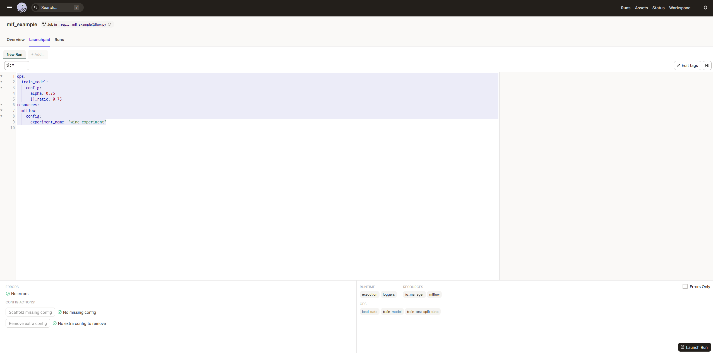
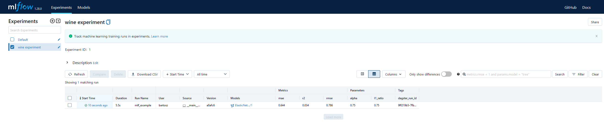

# MLOps demo with Dagster and MLFlow

## Description
Wine Quality prediction model based on Wine dataset

https://archive.ics.uci.edu/ml/datasets/wine+quality

### Data Set Information:

The two datasets are related to red and white variants of the Portuguese "Vinho Verde" wine. For more details, consult: [Web Link] or the reference [Cortez et al., 2009]. Due to privacy and logistic issues, only physicochemical (inputs) and sensory (the output) variables are available (e.g. there is no data about grape types, wine brand, wine selling price, etc.).

These datasets can be viewed as classification or regression tasks. The classes are ordered and not balanced (e.g. there are many more normal wines than excellent or poor ones). Outlier detection algorithms could be used to detect the few excellent or poor wines. Also, we are not sure if all input variables are relevant. So it could be interesting to test feature selection methods.


### Attribute Information:

For more information, read [Cortez et al., 2009].
Input variables (based on physicochemical tests):
1 - fixed acidity
2 - volatile acidity
3 - citric acid
4 - residual sugar
5 - chlorides
6 - free sulfur dioxide
7 - total sulfur dioxide
8 - density
9 - pH
10 - sulphates
11 - alcohol
Output variable (based on sensory data):
12 - quality (score between 0 and 10)


## Configure environment (This project ran on Ubuntu 22.04 WSL2 with pyenv based on Python 3.8.10)
### https://github.com/pyenv/pyenv
### https://github.com/pyenv/pyenv-installer
## pyenv setup
```console
# pyenv requirements
sudo apt-get update; sudo apt-get install make build-essential libssl-dev zlib1g-dev \
libbz2-dev libreadline-dev libsqlite3-dev wget curl llvm \
libncursesw5-dev xz-utils tk-dev libxml2-dev libxmlsec1-dev libffi-dev liblzma-dev
# pyenv setup
curl https://pyenv.run | bash
# follow the commands displayed in shell after the installation
```
## project setup
```console
pyenv install 3.8.10
pyenv virtualenv 3.8.10 mlops_demo
pyenv local mlops_demo
# ensure you are running virtalenv
pyenv shell mlops_demo
python -m pip install --upgrade pip
pip install -r requirements.txt
```

## To start run

```console
export MLFLOW_TRACKING_URI=http://localhost:5000
mlflow ui \
    --backend-store-uri sqlite:///mlflow.db \
    --default-artifact-root ./mlruns \
    --host 0.0.0.0

dagit -f src/flow.py
```

## To run an experiment in Dagster
open mlflow http://localhost:5000

open dagster http://localhost:3000

In dagster go to launchpad tab and set configuration:
```console
ops:
  train_model:
    config:
      alpha: 0.75
      l1_ratio: 0.75
resources:
  mlflow:
    config:
      experiment_name: "wine experiment"
```


Click [Launch Run] in bottom right

You should now see your experiment in MLflow

